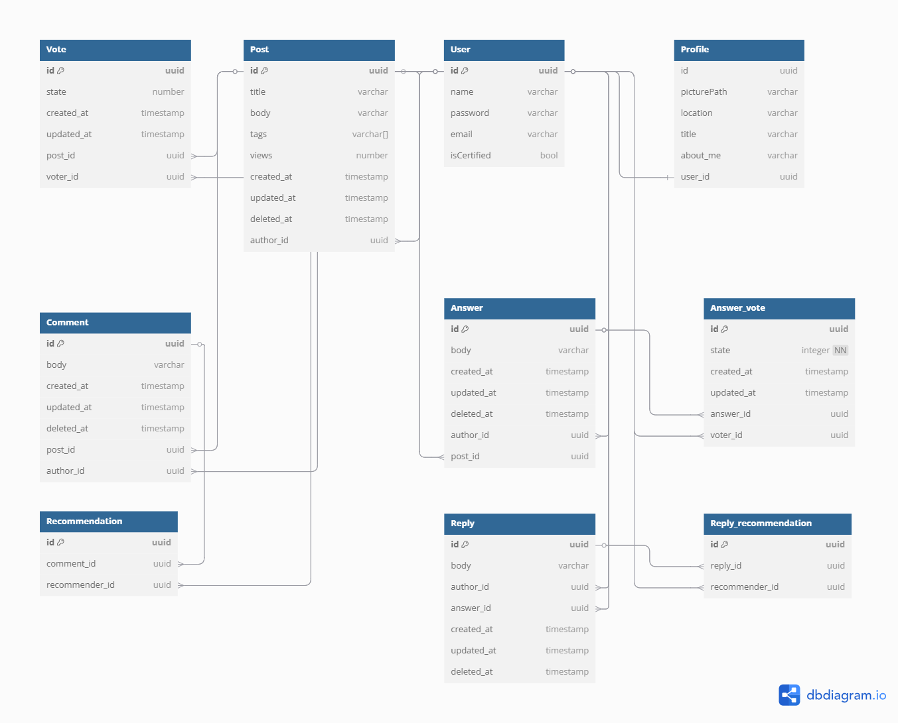

# 스택언더플로우

스택오버플로우의 주요 기능을 CloneCoding한 프로젝트로 NestJS에 익숙해지기 위해 진행하였습니다.

프로젝트 참여인원: 1명

# 프로젝트 실행 전 사전 요구 사항
패키지 설치
> npm i

.env파일 설정
> DB_HOST= databaseHostName // 데이터베이스 주소
> 
> DB_PORT= 5432 // 데이터베이스 주소
> 
> DB_USER = user // 데이터베이스 유저 이름
> 
> DB_PASSWORD = databasePassword1234! // 데이터베이스 비밀번호
> 
> DB_NAME = stackunderflow // 데이터베이스 이름
> 
> JWT_SECRET= JWT!SECRET! // JWT토큰 시크릿 키
> 
> COOKIE_SECRET = COOKIE!SECRET! // 쿠키 시크릿 키

main.ts에서 프론트엔드 주소 수정 필요.
> app.enableCors({
    origin: 'http://localhost:5173',
    credentials: true,
  });

# 로컬 환경에서 프로젝트 실행 방법
> npm run start:dev

# 프로젝트 기술 스택

 

# 프로젝트를 통해 얻은 것들
- NestJS의 기본적인 구조와 사용 방법에 대해 잘 알게 되었다.
- API 서버에 대한 이해를 높였다.
- TypeORM의 사용에 익숙해졌으며 트랜잭션에 대해 알게 되었고 쿼리 최적화에 대해서도 알게 되었다.
- JWT 토큰에 대해 이해하게 되었다.
- 타입스크립트의 기본적인 사용에 대해 익숙해졌다.
- 에러 모니터링에 대해 알게 되었다.
- 설계의 중요성에 대해 알게 되었다.

 

# 프로젝트에서 구현된 기능들
- 회원가입 및 로그인
- 질문 게시하기
- 답변 달기
- 질문 또는 답변에 투표하기
- 유저 프로필 생성 및 수정
- Slack을 통한 에러 모니터링

 

# ERD
https://dbdiagram.io/d/stackUnderFlow-67b2f1e4263d6cf9a064b943

> 보충 설명:
> Vote와 Recommendation은 각각 Post_vote와 Post_recommendation으로 포스팅 글의 투표와 포스팅 글의 추천에 대한 엔티티입니다.
> 설계 당시 Answer의 존재를 생각 하지 않았고 이로 인해 구체적인 이름을 지어주지 못해 혼란을 야기 했고 이에 대해서 반성하고 있습니다.

 

# 마주했던 문제점 및 해결 방법

  
1. 쿠키가 서버로 전송되지 않는 현상

알게된 것:
- 쿠키의 sameSite 설정에 대해 알게 되었다.
- CORS의 Credential 설정에 대해 알게 되었다.

해결 방법:  
- HTTPS를 사용하면 쿠키의 sameSite 설정을 none으로 설정할 수 있고 이렇게 설정되면 쿠키가 같은 사이트가 아니여도 전송이 된다.
- 서버의 설정에서 Credential을 허용하면 클라이언트는 요청을 보낼 때 쿠키와 HTTP 세션 정보를 같이 보낼 수 있다. 클라이언트에서도 withCredential 설정과 함께 요청을 보내면 쿠키가 서버에 전송이 된다.

  
2. 쿼리 동시성 문제

알게된 것:
- 데이터베이스에서는 여러 트랜잭션이 동시에 실행될 수 있기 때문에 동시성 문제가 발생할 수 있다.
- 여러 트랜잭션에서 같은 데이터를 읽을 때는 일관성 문제는 거의 발생하지 않는다. 그러나 쓰기 작업이 동시에 일어날 경우, 데이터 일관성이 깨질 수 있다.

해결 방법:  
- 트랜잭션에서 락을 사용하여 다른 트랜잭션이 같은 데이터에 접근하지 못하도록 할 수 있다. 
- Redis와 같은 메세지 큐를 활용하여, 쿼리 작업에 대해 순차적으로 처리 되게 만든다.
- 간단한 경우 데이터베이스의 원자적 연산을 활용한다.

  
3. N+1 Query 문제

알게된 것:
- SQL 쿼리를 할 때는 가능한 쿼리의 수를 줄이는 것이 좋다.
- 불필요한 SQL 쿼리는 서버의 performance를 저하시킨다.

해결 방법:  
- JOIN문을 이용하여 한 번의 쿼리로 모든 데이터를 가져오게 만든다.
- VIEW를 만들어 자주 가져오는 데이터들로 이루어진 가상 테이블을 만들고 View에 쿼리를 한다.

 

# 프로젝트 회고
- 스택오버플로우를 자주 사용해봤기 때문에 스택오버플로우에 대해서 잘 안다고 생각했다. 오만한 생각이였다. 탑-다운 방식으로 구현하면서 내가 인지하지 못하거나 잘못 인지하고 있었던 부분 때문에 새로 고치는 일이 많았다. 업무에 대해 정확히 파악하고 설계하는 것이 중요하다는 것을 깨달았다.

- 프론트엔드와 백엔드의 데이터 송신 및 수신에 대해 많은 고민이 필요하다는 것을 알았다. 백엔드에서는 프론트엔드에서 필요한 데이터를 알기 쉬운 형태로 보내야 하는 것이 중요했다.

- ERD를 프로그램을 만들면서 필요할 때마다 엔티티를 추가했는데 이로 인해 엔티티 이름이 충분히 구체적이지 못해 혼란을 줄 수 있는 이름을 가진 엔티티가 만들어 졌다. 당장 편한 것만을 추구하다가 이후에 문제를 남길 수 있다는 것을 알게 되었다.

# 추후 보완할 부분
- 현재 중요하다고 생각하는 기능들만 만들어져 있다. 나머지 부분들을 만들 것이다.
- API의 성능 개선 방법들(캐싱, 압축, 페이지네이션 등등)을 적용시켜 볼 것이다.
- API 테스팅을 해 볼 것이다.